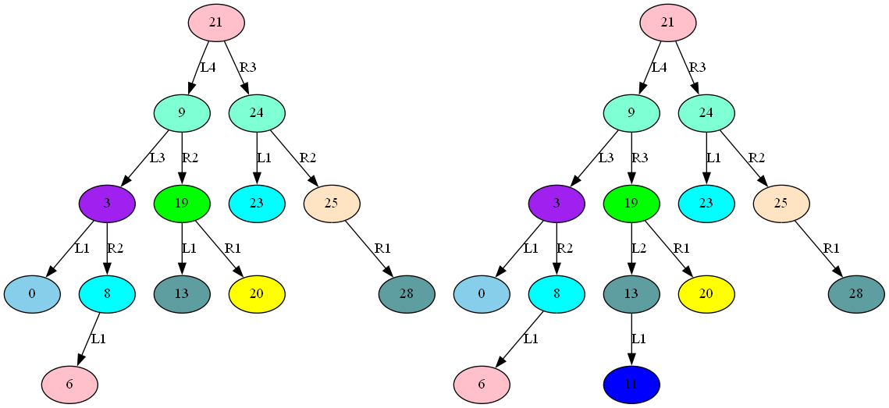

# 订单簿重建算法 python模型

使用python实现订单簿重建算法，用于评估FPGA实现所需的资源和算法。

## 快照重建算法行为模型 ([behave](behave/axob.py))

这里的快照是指仅有买卖n档价格和委托总量，但没有价格档的委托队列的订单簿截面数据。

目前实现了深交所快照重建的主要功能，支持深交所限价单、市价单、创业板价格笼子、波动性中断，有能力生成全档快照和价格笼子外快照。

由于深交所的成交消息是紧跟在委托之后的，所以可在收到委托后先缓存，待收齐对应的成交消息后，根据成交内容修改价格档位和委托数量，从而生成新的快照。

优势：只需要维护价格档，不需要管理委托队列，数据结构简单。

劣势：更新订单簿的速度不仅依赖逐笔委托还依赖逐笔成交；只能发布价格档、没有对应的订单队列。

测试方法：基于逐笔委托和逐笔成交维护本地买卖价格档，当价格档发生任意变化时即生成一个本地快照，所有的这些本地快照形成一个集合，如果交易所发出的快照是此集合的子集，则说明算法正确，否则分析差异、改进算法。

## 公共工具 ([tool](tool))

* msg_util: 行情数据类，可读取本项目使用的L2历史文件

## 二叉树模型 ([binaryTree](binaryTree))

在FPGA实现时，需要对价格档位建树，每只个股需要一颗买方树和一颗卖方树，先用python在AVL树和红黑树间评估哪种更合适。

特点：为便于FPGA实现，没有采用递归，但需要一块ram做缓存；可以导出树的结构图，观察树的结构变化和平衡性，如下图，导出图固定存放在```AXOrderBook/log/binTreeView```目录下。



## 执行

python部分不是一个库，因此没有提供安装。

可执行脚本都在```AXOrderBook/py```目录中，都需在本git的根目录(```AXOrderBook```)下运行，如:

```s
cd AXOrderBook
python py/run_test_xxx.py
```

或使用vscode：

```t
先使用vscode打开整个AXOrderBook目录，打开py目录下run_test_xxx.py，再通过选择菜单"Run"->"Run Without Debugging"运行。
```

执行生成的log文件都在```AXOrderBook/log```中。

## 测试记录：

### 深交所股票

pattern|状态|日期|源
--|--|--|--
20220608| 尚余:退市B股，进入退市整理期首日 |  | D.R.
20220609| OK | 11/30 | D.T.
20220610| OK | 11/29 | D.T.
20220620| OK | 11/30 | D.T.
20220621| OK | 11/29 | D.T.
20220622| OK | 11/29 | D.T.
20220623| OK | 11/30 | D.T.
20220707| OK | 12/01 | D.R.
20220802| OK | 12/01 | D.R.
20220803| OK | 12/01 | D.R.
20220804| OK | 12/03 | D.R.
20220805| 尚余:新股上市首日 |       | D.R.
20220808| 尚余:新股上市首日 |       | D.R.
20220812| OK | 11/25 | D.T.
20221010| OK | 11/24 | S.R.
